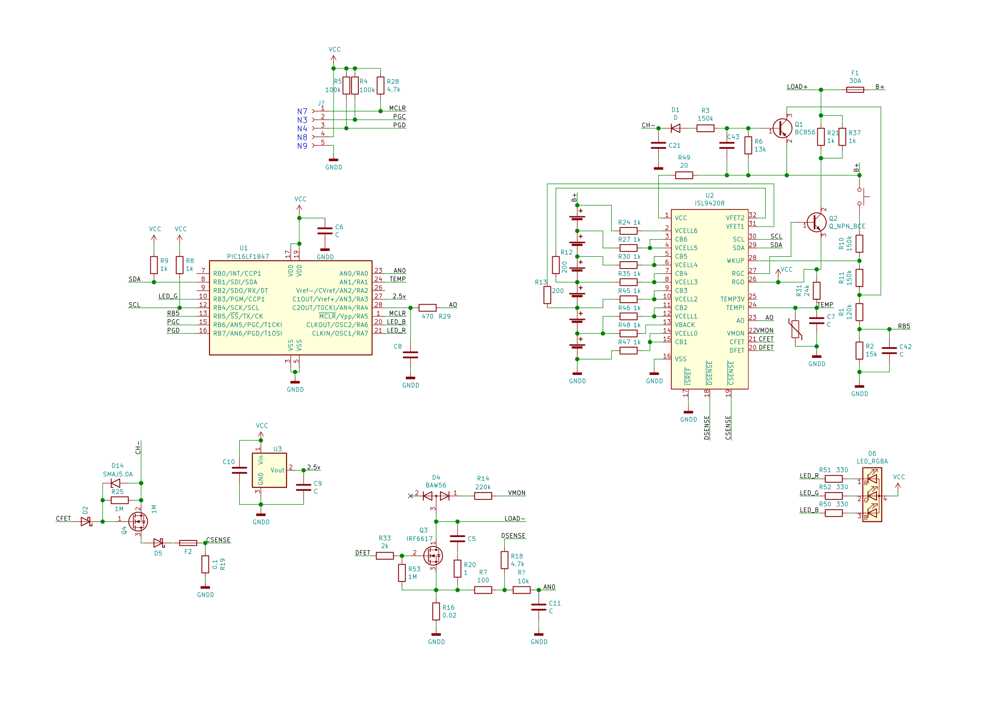
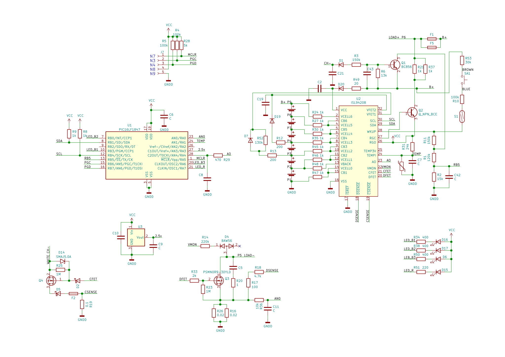

# open-dyson-battery

Open source implementation of Dyson cordless vacuum cleaner battery firmware.

## DISCLAIMER

This project is created for purely educational purposes.
Li-ion batteries are high energy devices that may catch fire or explode 
if mishandled.
Review the code and use it at your own risk.

## Features

Current status of firmware is 'proof of concept'.

Implemented features:
 * Basic button handling. Turn on/off.
 * Charging (without temperature monitoring)
 * Stop charging by voltage monitoring of each cell.
 * Stop operation if voltage of any of the cells is dropped below limit.
 * Basic LED indication (charging, operation)

## TODO

 * Temperature monitoring (external and internal thermistors)
 * Show charge state with LED
 * Show level of cells unbalance with LED

## Hardware
All older Dyson batteries are based on pic16lf1847 microcontroller with
ISL94208 battery controller.
Both ICs have excellent documentation from the manufacture.

### Dyson V6 battery
Reverse engineered schematic of v6 battery with marking 188002 on the board.

### Dyson V8 battery
This is pretty much the same as v6 with some minor changes.
Reverse engineered schematic of v8 battery with marking 180207 on the board.

## Contributing

Pull requests for new features, bug fixes, and suggestions are welcome!

## License
[MIT](LICENSE)

